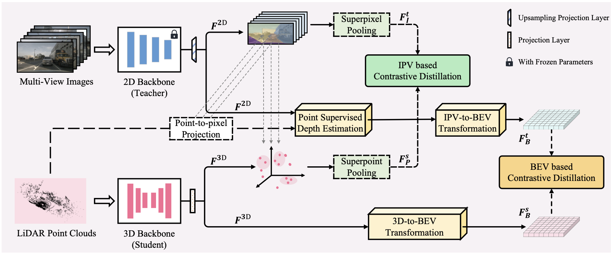

# HVDistill: Transferring Knowledge from Images to Point Clouds via Unsupervised Hybrid-View Distillation

Official PyTorch implementation of the method **HVDistill**. More details can be found in the paper:

**HVDistill: Transferring Knowledge from Images to Point Clouds via Unsupervised Hybrid-View Distillation**, IJCV 2024 [[arXiv](https://arxiv.org/pdf/2403.11817v1)]
by *Sha Zhang, Jiajun Deng, Lei Bai, Houqiang Li, Wanli Ouyang*



If you use HVDistill in your research, please consider citing:
```
@InProceedings{hvdistill,
  title={HVDistill: Transferring Knowledge from Images to Point Clouds via Unsupervised Hybrid-View Distillation},
  author={Zhang, Sha and Deng, Jiajun and Bai, Lei and Li, Houqiang and Ouyang, Wanli and Zhang, Yanyong},
  journal={International Journal of Computer Vision},
  pages={1--15},
  year={2024},
  publisher={Springer}
}
```

## Dependencies

The main dependencies of the project are the following:
```shell
python: 3.8
cuda: 11.1
```

You can set up a conda environment as follows:
```shell
pip install -r requirements.txt
```

## Reproducing the results

### Stage 1: Pre-training
Before pretrain, you should generate the superpixels following [This code](https://github.com/valeoai/SLidR).
then, you can pretrain the model by running the following command:

```bash pretrain.sh config/pretrain.yaml```

Or you can get the pretrained model from [here](https://drive.google.com/file/d/18vIqocY-30M_Uj1kGJWt88hJctYIWshA/view?usp=sharing).

### Stage 2: Downstream Task -- Semantic segmentation

```bash downstream.sh config/downstream/2_semseg_nuscenes.yaml```


## Acknowledgement
This repo is mainly built upon [SLidR](https://github.com/valeoai/SLidR). Besides, we also use the code from [BEVformer](https://github.com/fundamentalvision/BEVFormer). Thanks for their wonderful works.

## License
HVDistill is released under the [Apache 2.0 license](./LICENSE).